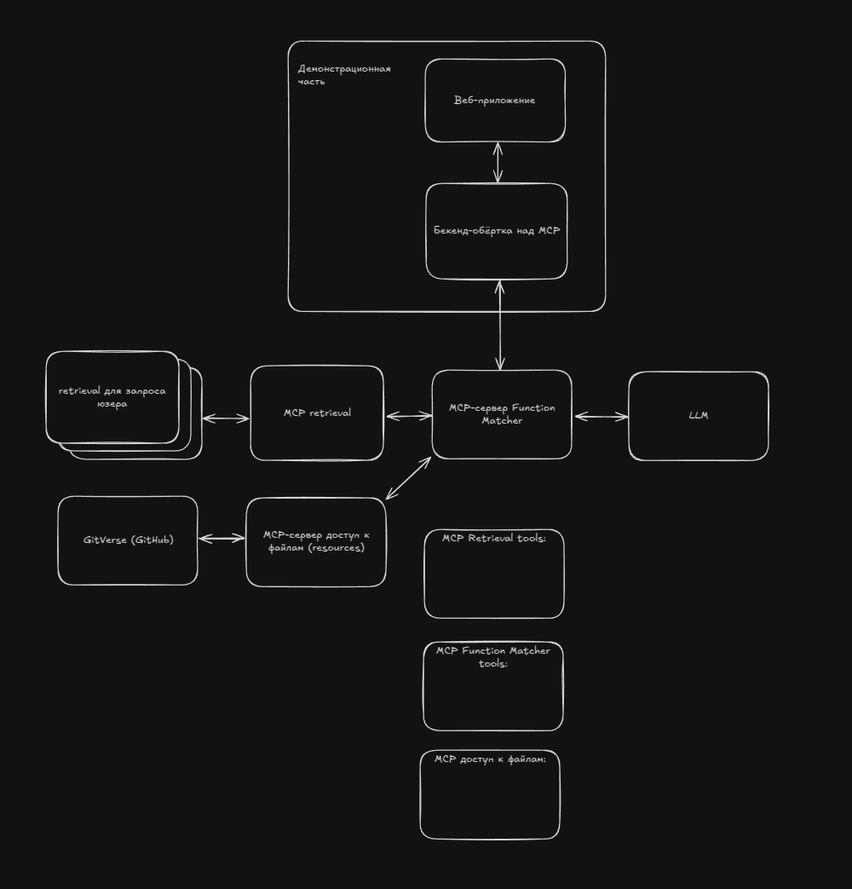

# Sber AI Hackathon 2025

В данном репозитории содержится код бекенда для кейса "Агент Function Matcher", разработанный командой [AllSee.team](https://allSee.team).

# Описание архитектуры решения

## Workflow агента


## Архитектура решения



# Программные интерфейсы

0. Фронт
    ```
    // Найти функционально похожий: ["a. код", "б. файл", "в. репозиторий"]

    // Референс: ["a. поле ввода кода", "поле ввода ссылки на файл", "поле ввода ссылки на репозиторий"]

    // Опционально: Поле ввода ограничений по репозиториям (список ссылок с поиском)
    ```

1. Бекенд обёртка - просто перенаправить на MCP

2. MCP - Function Matcher
    ```
    from pydantic import BaseModel
    

    class CodeSimilarityRequest(BaseModel):
        code: str # код для поиска
        allow_repositories: List[str] # список репозиториев, в которых искать (по умолчанию все репозитории)

    class FileSimilarityRequest(BaseModel):
        file_url: str # ссылка на файл для поиска
        allow_repositories: List[str] # список репозиториев, в которых искать (по умолчанию все репозитории)

    class RepositorySimilarityRequest(BaseModel):
        repository_url: str # ссылка на репозиторий для поиска
        allow_repositories: List[str] # список репозиториев, в которых искать (по умолчанию все репозитории)

    class CodeSimilarityResult(BaseModel):
        repository_url: str # ссылка на репозиторий
        branch: str # ветка репозитория
        file_path: str # путь к файлу в репозитории
        code: Optional[str] # кусочек кода из файла

    class FileSimilarityResult(BaseModel):
        repository_url: str # ссылка на репозиторий
        branch: str # ветка репозитория
        file_path: str # путь к файлу в репозитории
        code: Optional[str] # код из файла

    class RepositorySimilarityResult(BaseModel):
        repository_url: str # ссылка на репозиторий
        branch: str # ветка репозитория
        file_path: str # путь к файлу в репозитории
        code: Optional[str] # код из репозитория


    # --- Tools ---
    
    # Название: search_similar_code
    # Описание: "Ищет функционально похожий код в репозиториях"
    # Параметры: CodeSimilarityRequest
    # Возвращает: List[CodeSimilarityResult]

    # Название: search_similar_file
    # Описание: "Ищет функционально похожий файл в репозиториях"
    # Параметры: FileSimilarityRequest
    # Возвращает: List[FileSimilarityResult]

    # Название: search_similar_repository
    # Описание: "Ищет функционально похожий репозиторий"
    # Параметры: RepositorySimilarityRequest
    # Возвращает: List[RepositorySimilarityResult]
    ```

По идее, [вот так](https://github.com/modelcontextprotocol/python-sdk?tab=readme-ov-file#context) можно передавать прогресс на фронт 

3. MCP GitHub - по сути нужен только tool для просмотра файлов и папок в [таком формате](https://github.com/modelcontextprotocol/servers/tree/main/src/github#:~:text=get_file_contents,File/directory%20contents)

4. MCP Retrieval
    ```
    from pydantic import BaseModel
    

    class CodeSimilarityRequest(BaseModel):
        code: str # код для поиска
        allow_repositories: List[str] # список репозиториев, в которых искать (по умолчанию все репозитории)

    class FileSimilarityRequest(BaseModel):
        file_url: str # ссылка на файл для поиска
        allow_repositories: List[str] # список репозиториев, в которых искать (по умолчанию все репозитории)

    class RepositorySimilarityRequest(BaseModel):
        repository_url: str # ссылка на репозиторий для поиска
        allow_repositories: List[str] # список репозиториев, в которых искать (по умолчанию все репозитории)

    class CodeSimilarityResult(BaseModel):
        repository_url: str # ссылка на репозиторий
        branch: str # ветка репозитория
        file_path: str # путь к файлу в репозитории
        code: Optional[str] # кусочек кода из файла

    class FileSimilarityResult(BaseModel):
        repository_url: str # ссылка на репозиторий
        branch: str # ветка репозитория
        file_path: str # путь к файлу в репозитории
        code: Optional[str] # код из файла

    class RepositorySimilarityResult(BaseModel):
        repository_url: str # ссылка на репозиторий
        branch: str # ветка репозитория
        file_path: str # путь к файлу в репозитории
        code: Optional[str] # код из репозитория


    # --- Tools ---
    
    # Название: search_similar_code
    # Описание: "Ищет функционально похожий код в репозиториях"
    # Параметры: CodeSimilarityRequest
    # Возвращает: List[CodeSimilarityResult]

    # Название: search_similar_file
    # Описание: "Ищет функционально похожий файл в репозиториях"
    # Параметры: FileSimilarityRequest
    # Возвращает: List[FileSimilarityResult]

    # Название: search_similar_repository
    # Описание: "Ищет функционально похожий репозиторий"
    # Параметры: RepositorySimilarityRequest
    # Возвращает: List[RepositorySimilarityResult]
    ```
    
**!!!** Отличие от MCP Function Matcher - в том, что MCP Retrieval использует векторный поиск для поиска похожего кода, а Function Matcher получает релевантные документа, а потом пускает по ним агента.

Как рефернс, можно использовать вот эти репо: 
* https://github.com/chroma-core/chroma-mcp
* https://github.com/qdrant/mcp-server-qdrant

Основное отличие будет в том, что нам нужно сделать дополнительную обёртку вокруг фильтров по метаинформации, чтобы можно было искать по репозиториям, а также самостоятельно извлекать код из указанного источника, т.к. LLM просто не сможет нормально передавать сразу текст размером в репозторий.

# Как всё будет работать

0. Подготовка, инициализируем базы в MCP Retrieval, поднимаем остальные сервисы
1. Пользователь вводит код, файл или репозиторий
2. Бекенд обёртка отправляет запрос в MCP Function Matcher (имитирует вызов соответствующего tool из агента)
3. MCP Function Matcher отправляет запрос в MCP Retrieval, чтобы найти похожий код, файл или репозиторий
4. Aгент внутри MCP Function Matcher получает список похожих кодов, файлов или репозиториев и проверяет их на наличие функционально похожего кода используя MCP GitHub, возвращает результат, который передаётся, как результат вызова tool MCP Function Matcher
5. Результат возвращается в бекенд обёртку
6. Бекенд обёртка возвращает результат на фронт

Если успеем, то можно добавить агенту внутри MCP Function Matcher рекурсивно запускать этапы 3-4, чтобы искать похожий код внутри найденного кода, файлов или репозиториев, но базовая версия будет работать и без этого.

# Рекомендации по разработке
1. Каждый сервис запускается в отдельном контейнере, используем docker-compose
2. Новый функционал добавляем в issue, разработку ведём в отдельной ветке